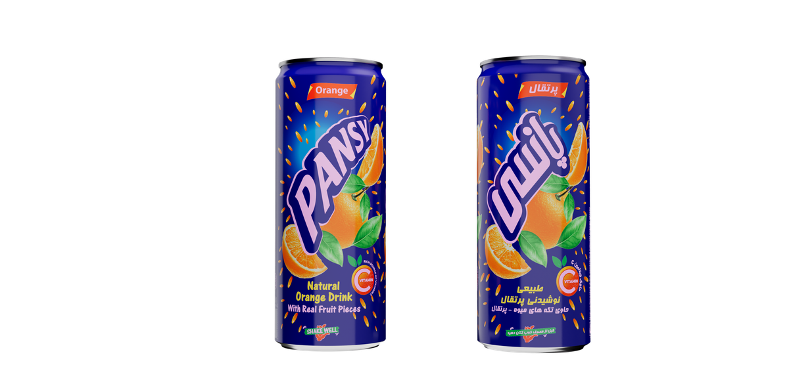

# Golestan Khorasan — پانسی

Corporate website for **Golestan Khorasan**, a food manufacturing company based in Herat, Afghanistan.
The brand produces natural juices, baking yeast, and packaged foods under the **Pansy (پانسی)** label.

**Live site:** https://golestan-khorasan.vercel.app

---

## Screenshot



---

## Tech Stack

| Layer | Technology |
|---|---|
| Framework | Next.js 14 (App Router) |
| Language | TypeScript 5 |
| Styling | Tailwind CSS + custom CSS |
| Animation | Framer Motion (scroll-reveal, carousel) |
| Font | Vazirmatn (Google Fonts — Persian/Arabic) |
| Layout | RTL (`lang="fa" dir="rtl"`) |
| Contact form | Formspree |
| Deployment | Vercel |

---

## Features

- Fully **right-to-left (RTL) Persian** UI
- Product showcase with anchor navigation
- Brand story, stats, and gallery sections
- Contact form with client-side validation and Formspree submission
- Privacy policy and terms of service pages
- Auto-generated `sitemap.xml` and `robots.txt`
- Custom 404 page
- Open Graph / Twitter Card meta tags
- No-JS static export — all pages pre-rendered at build time

---

## Local Setup

```bash
# 1. Install dependencies
npm install

# 2. Configure environment variables
cp .env.local.example .env.local
# Open .env.local and fill in NEXT_PUBLIC_FORMSPREE_ID
# (create a free form at https://formspree.io)

# 3. Start the development server
npm run dev
# → http://localhost:3000

# 4. Production build (optional)
npm run build
```

---

## Project Structure

```
app/           Next.js App Router pages and layouts
components/    Reusable UI components
data/          site.ts — single source of truth for all content
lib/           Utility helpers (cn, social URLs)
public/        Static assets (logo, product images)
```

---

## Content Management

All site copy lives in [`data/site.ts`](data/site.ts) — edit `siteConfig`, `navLinks`, `products`,
and `posts` there to update content without touching components.

Social media links are configured in [`lib/social.ts`](lib/social.ts).
Empty strings hide the corresponding icon automatically.
